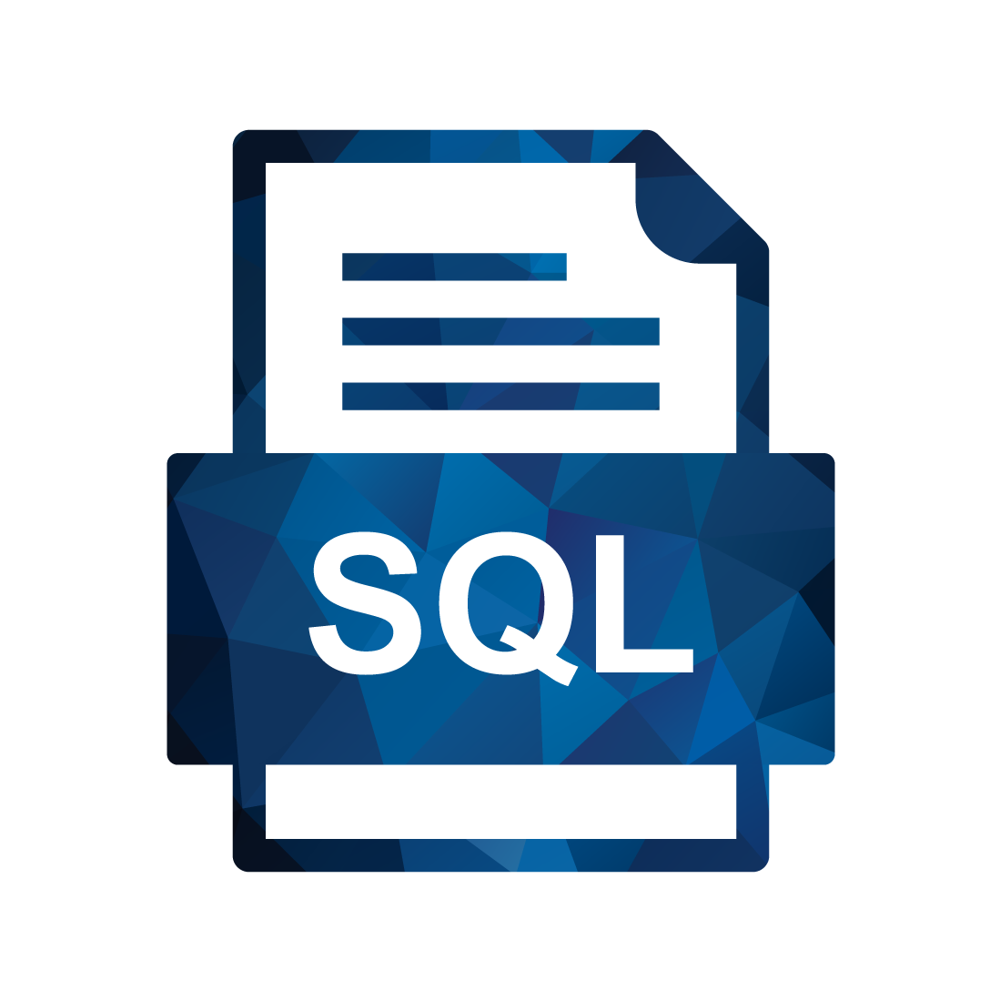

# SQL For Developer Tutorial 
  

## Hello, welcome to my tutorial for SQL. 👋
In this tutorial, we will perform all the basic to advanced SQL statements with sample dataset. 👩‍🏫👨‍🏫

*******
Tables of contents  
 1. [MySQL](https://github.com/quaan2hand/sql-for-developer/mysql)
 2. [MSSQL](https://github.com/quaan2hand/sql-for-developer/mssql)
 3. [PostgreSQL](https://github.com/quaan2hand/sql-for-developer/postgresql)

- MySQL data sample [here](https://github.com/quaan2hand/sql-for-developer/mysql/mysqlsampledatabase.sql).
- MSSQL data sample [here](https://github.com/LewisVo/Markdown-Tutorial/blob/master/README_pt-BR.md).
- PostgreSQL data sample [here](https://github.com/luongvo209/Markdown-Tutorial/blob/master/README_fr.md).

*******

  

## What is SQL ?    

  >*Structured Query Language (SQL) is a computer language that we use to interact with a relational database. SQL is a tool for organizing, managing, and retrieving archived data from a computer database. *

These SQL commands are mainly categorized into five categories: 

1. [DDL – Data Definition Language]()
2. [DQL – Data Query Language]()
3. [DML – Data Manipulation Language]()
4. [DCL – Data Control Language]()
5. [TCL – Transaction Control Language]()